{width="1.0926727909011373in"
height="1.468837489063867in"}

**UNIVERSIDAD PRIVADA DE TACNA**

**FACULTAD DE INGENIERÍA**

**Escuela Profesional de Ingeniería de Sistemas**

**Proyecto *AnzenCore***

Curso: *Calidad y Pruebas de Software*

Docente:Patrick Jose Cuadros Quiroga

Integrantes:

***Arocutipa Arocutipa, Gian Franco (2023076790)***

***Perez Peralta, Fabrizio Salvador Elias (2023077476)***

**Tacna -- Perú**

***2026***

+--------------------------------------------------------------------------------------------+
| CONTROL DE VERSIONES                                                                       |
+-------------+-------------+-------------+-------------+-------------+----------------------+
| Versión     | Hecha por   | Revisada    | Aprobada    | Fecha       | Motivo               |
|             |             | por         | por         |             |                      |
+-------------+-------------+-------------+-------------+-------------+----------------------+
| 1.0         | MPV         | ELV         | ARV         | 01/15/2026  | Versión Original     |
+=============+=============+=============+=============+=============+======================+

Sistema AnzenCore

Documento de Arquitectura de Software

Versión *{1.0}*

+--------------------------------------------------------------------------------------------+
| CONTROL DE VERSIONES                                                                       |
+-------------+-------------+-------------+-------------+-------------+----------------------+
| Versión     | Hecha por   | Revisada    | Aprobada    | Fecha       | Motivo               |
|             |             | por         | por         |             |                      |
+-------------+-------------+-------------+-------------+-------------+----------------------+
| 1.0         | G.A. / F.P. |             |             | 27/04/2026  | Versión Original     |
+=============+=============+=============+=============+=============+======================+

ÍNDICE GENERAL

[**1. Introducción 4**](#introducción)

> [1.1. Propósito 4](#propósito)
>
> [1.2. Alcance 4](#alcance)
>
> [1.3. Definición, siglas y abreviaturas
> 5](#definición-siglas-y-abreviaturas)
>
> [1.4. Organización del documento 6](#organización-del-documento)

[**2. Objetivos y Restricciones Arquitectónicas
6**](#objetivos-y-restricciones-arquitectónicas)

> [2.1. Priorización de requerimientos
> 6](#priorización-de-requerimientos)
>
> [2.2. Restricciones 7](#restricciones)

[**3. Representación de la Arquitectura del Sistema
8**](#representación-de-la-arquitectura-del-sistema)

> [3.1. Vista de Caso de Uso 8](#vista-de-caso-de-uso)
>
> [3.1.1. Diagramas de Casos de Uso 8](#diagramas-de-casos-de-uso)
>
> [3.2. Vista Lógica 10](#vista-lógica)
>
> [3.2.1. Diagrama de Subsistemas 10](#diagrama-de-subsistemas)
>
> [3.2.2. Diagrama de Secuencia 13](#diagrama-de-secuencia)
>
> [3.2.3. Diagrama de Colaboración 14](#diagrama-de-colaboración)
>
> [3.2.4. Diagrama de Objetos 15](#diagrama-de-objetos)
>
> [3.2.5. Diagrama de Clases 15](#diagrama-de-clases)
>
> [3.2.6. Diagrama de Base de Datos 18](#diagrama-de-base-de-datos)

[**3.3. Vista de Implementación 20**](#vista-de-implementación)

> [3.3.1. Diagrama de Arquitectura Software(paquetes)
> 20](#diagrama-de-arquitectura-softwarepaquetes)
>
> [3.3.2. Diagrama de Arquitectura del Sistema(Diagrama de Componentes)
> 21](#diagrama-de-arquitectura-del-sistemadiagrama-de-componentes)

**3.4. Vista de Procesos 22**

> [**3.4.1. Diagrama de Procesos del Sistema (diagrama de actividad)
> 22**](#diagrama-de-procesos-del-sistema-diagrama-de-actividad)

[**3.5. Vista de Despliegue 26**](#vista-de-despliegue)

> [**3.5.1. Diagrama de Despliegue 26**](#diagrama-de-despliegue)

[**4. ATRIBUTOS DE CALIDAD DEL SOFTWARE
27**](#atributos-de-calidad-del-software)

> [4.1. Escenario de Funcionalidad 27](#escenario-de-funcionalidad)
>
> [4.2. Escenario de Usabilidad 28](#escenario-de-usabilidad)
>
> [4.3. Escenario de Confiabilidad 28](#escenario-de-confiabilidad)
>
> [4.4. Escenario de Rendimiento 29](#escenario-de-rendimiento)
>
> [4.5. Escenario de Mantenibilidad 29](#escenario-de-mantenibilidad)
>
> [4.6. Escenario de Seguridad 29](#escenario-de-seguridad)

[**5. CONCLUSIONES 30**](#conclusiones)

[**6. RECOMENDACIONES 30**](#recomendaciones)

# Introducción

## Propósito

> El presente documento describe la arquitectura de software del sistema
> AnzenCore, una plataforma web con componente móvil (APK) orientada a
> la auditoría de seguridad de dispositivos Android y a la educación del
> usuario en ciberseguridad.
>
> La arquitectura se representa bajo el modelo de vistas 4+1 de Philippe
> Kruchten, que organiza la descripción arquitectónica en cinco vistas
> complementarias: Vista de Casos de Uso, Vista Lógica, Vista de
> Implementación, Vista de Procesos y Vista de Despliegue. Este enfoque
> permite comunicar la arquitectura a distintos stakeholders: usuarios,
> desarrolladores, integradores y gestores del proyecto.
>
> La arquitectura responde a los requerimientos funcionales y no
> funcionales definidos en el documento SRS de AnzenCore, priorizando la
> seguridad en la transmisión de datos, la privacidad del usuario y la
> escalabilidad del sistema para soportar hasta 10,000 usuarios
> concurrentes.

## Alcance

> El documento se centra en el desarrollo de la vista lógica del sistema
> AnzenCore. Se incluyen los aspectos fundamentales del resto de las
> vistas arquitectónicas que permiten comprender el diseño global del
> sistema. El sistema AnzenCore comprende:

- Plataforma Web MVC en PHP: backend, dashboard, ranking e historial de
  análisis

- APK Android en Kotlin: escaneo del dispositivo, generación y envío de
  reporte cifrado.

- Módulo Educativo: micro-lecciones interactivas y puzzle gamificado de
  vulnerabilidades.

- API REST: comunicación cifrada entre la APK y la plataforma web.

- Sistema de Ranking: puntuación de seguridad, ranking semanal y global.

## Definición, siglas y abreviaturas

  **Término / Sigla**   **Definición**
  --------------------- ------------------------------------------------------------------------------------------------
  MVC                   Model-View-Controller. Patrón arquitectónico de separación de responsabilidades.
  APK                   Android Package Kit. Formato de paquete de instalación para Android.
  API REST              Application Programming Interface basada en principios REST (Representational State Transfer).
  AES-256               Advanced Encryption Standard con clave de 256 bits. Algoritmo de cifrado simétrico.
  TLS                   Transport Layer Security. Protocolo de seguridad para comunicaciones en red.
  SHA-256               Secure Hash Algorithm de 256 bits. Función hash criptográfica.
  Score                 Puntuación de seguridad del dispositivo (0-100) calculada por el sistema.
  QA                    Quality Attribute. Atributo de calidad del software.
  SRS                   Software Requirements Specification. Especificación de Requerimientos de Software.
  BD                    Base de Datos.
  SO                    Sistema Operativo.
  CU                    Caso de Uso.

## 

## Organización del documento

> El documento se organiza de la siguiente manera:
>
> •Sección 1 -- Introducción: propósito, alcance, definiciones y
> organización.
>
> •Sección 2 -- Objetivos y Restricciones Arquitectónicas: priorización
> de requerimientos funcionales y no funcionales.
>
> •Sección 3 -- Representación de la Arquitectura: cinco vistas (Casos
> de Uso, Lógica, Implementación, Procesos, Despliegue) con sus
> respectivos diagramas.
>
> •Sección 4 -- Atributos de Calidad: escenarios de calidad evaluados
> para el sistema.

# Objetivos y Restricciones Arquitectónicas

> Esta sección establece las prioridades de los requerimientos y las
> restricciones del proyecto AnzenCore desde la perspectiva
> arquitectónica.

## Priorización de requerimientos

1.  Requerimientos funcionales

  **ID**   **Descripción**                                                              **Prioridad**
  -------- ---------------------------------------------------------------------------- ---------------
  RF-01    Permitir registro de usuarios con email y contraseña. Validar email único.   Alta
  RF-02    Iniciar sesión con credenciales. Generar token de sesión.                    Alta
  RF-03    Generar APK con session_id SHA-256 único por descarga.                       Alta
  RF-04    Analizar versión SO, apps instaladas, permisos, USB debug, certs raíz.       Alta
  RF-05    Cifrar reporte con AES-256 y enviarlo a /api/report vía HTTPS.               Alta
  RF-06    Procesar reporte, calcular score (0-100) y persistir en BD.                  Alta
  RF-07    Ver dashboard con score, vulnerabilidades y puzzle.                          Alta
  RF-08    Ver y completar micro-lección de cada vulnerabilidad.                        Media
  RF-09    Marcar vulnerabilidad corregida; sistema actualiza score.                    Media
  RF-10    Recalcular ranking semanal/global cada 24 horas.                             Media
  RF-11    Ver historial de análisis con gráfico de evolución.                          Alta
  RF-12    Descargar nueva APK para reanálisis tras correcciones.                       Media

2.  Requerimientos No Funcionales -- Atributos de Calidad

  **ID**   **Categoría**    **Requerimiento No Funcional**
  -------- ---------------- --------------------------------------------------------------------------
  RNF-01   Seguridad        Todos los reportes de análisis deben transmitirse cifrados con TLS 1.2+.
  RNF-02   Privacidad       La APK no debe leer, acceder ni almacenar contactos, mensajes o fotos.
  RNF-03   Rendimiento      El análisis del dispositivo debe completarse en menos de 60 segundos.
  RNF-04   Disponibilidad   La plataforma web debe estar disponible el 99% del tiempo (24/7).
  RNF-05   Usabilidad       El dashboard debe ser responsivo y usable en pantallas desde 320px.
  RNF-06   Compatibilidad   La APK debe ser compatible con Android 8.0 (API 26) o superior.
  RNF-07   Mantenibilidad   El backend debe seguir estrictamente el patrón MVC con PHP.
  RNF-08   Escalabilidad    La arquitectura debe soportar hasta 10,000 usuarios concurrentes.
  RNF-09   Portabilidad     La plataforma web debe funcionar en Chrome, Firefox, Safari y Edge.

## Restricciones

> •El backend web debe implementarse estrictamente con el patrón MVC en
> PHP.
>
> •La APK debe desarrollarse en Kotlin y ser compatible desde Android
> 8.0 (API 26).
>
> •No se permite almacenar datos personales del usuario en la APK
> (contactos, fotos, mensajes).
>
> •Toda comunicación entre la APK y la API REST debe realizarse sobre
> HTTPS/TLS 1.2+.
>
> •El cifrado del reporte de análisis debe realizarse con AES-256 antes
> del envío.
>
> •El proyecto se desarrolla en entorno académico con recursos de
> hosting compartido.
>
> •La APK es efímera: cada sesión genera una APK única válida por 24
> horas.
>
>  

# Representación de la Arquitectura del Sistema

> La arquitectura de AnzenCore se documenta bajo el modelo de vistas
> 4+1, que permite representar el sistema desde múltiples perspectivas
> complementarias para dar respuesta a los distintos intereses de los
> stakeholders.

## Vista de Caso de Uso

> La vista de casos de uso describe las funcionalidades centrales del
> sistema AnzenCore, los actores que interactúan con él y los escenarios
> que tienen mayor impacto arquitectónico. Esta vista activa y valida
> las demás vistas de la arquitectura.
>
> El sistema AnzenCore cuenta con dos actores principales: el Usuario
> Final (novato o avanzado) y el Administrador. La APK Android actúa
> como actor secundario del sistema durante el proceso de análisis y
> envío de reportes.

## Diagramas de Casos de Uso

> A continuación se presenta el diagrama de casos de uso principal del
> sistema. Los casos de uso centrales con mayor cobertura arquitectónica
> son: CU-03 , CU-04/05 , CU-06 y CU-07.

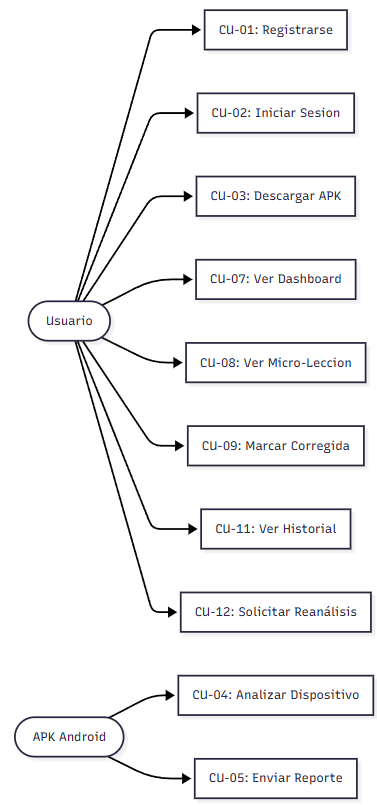{width="3.46875in"
height="6.718403324584427in"}

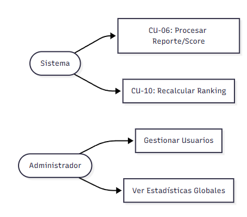{width="3.483198818897638in"
height="3.062153324584427in"}

## Vista Lógica

> La vista lógica representa los requerimientos funcionales del sistema
> AnzenCore. Describe las partes del diseño del modelo significativas
> para la arquitectura: subsistemas, paquetes, clases y sus relaciones.
> AnzenCore se estructura en cinco subsistemas principales:
> Autenticación, Análisis (APK), Dashboard, Educativo y Ranking.

## Diagrama de Subsistemas

> El sistema se organiza en los siguientes paquetes arquitectónicos
> principales:

- Paquete Web (PHP MVC): Controladores, Modelos, Vistas, API REST.

- Paquete APK (Kotlin): OSAnalyzer, PermissionAnalyzer, AppAnalyzer,
  CertAnalyzer, ReportBuilder, NetworkClient.

- Paquete Base de Datos: MySQL con tablas para usuarios, reportes,
  vulnerabilidades, lecciones y ranking.

- Paquete Seguridad: Módulo de cifrado AES-256, gestión de tokens de
  sesión y TLS.

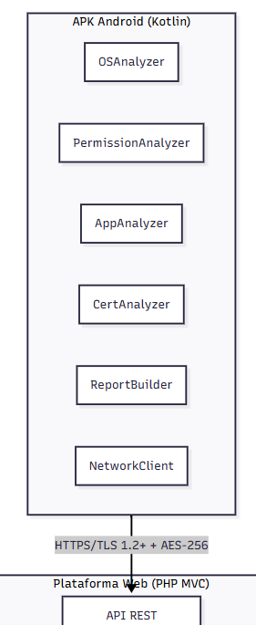{width="2.1625087489063866in"
height="5.27048665791776in"}

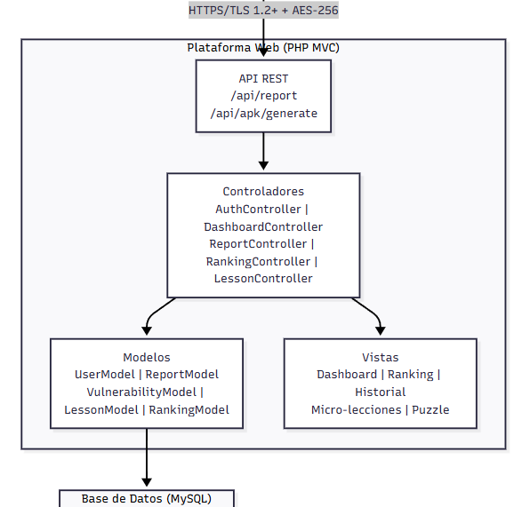{width="4.861509186351706in"
height="4.80173665791776in"}

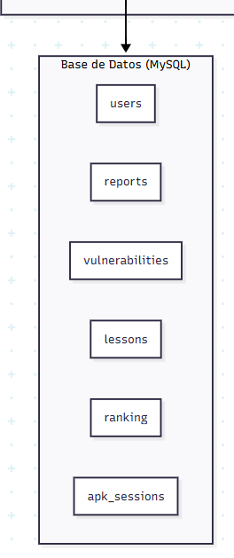{width="2.5416666666666665in"
height="5.291319991251093in"}

## Diagrama de Secuencia

> Los diagramas de secuencia más relevantes arquitectónicamente son el
> proceso de Análisis de Dispositivo y Envío de Reporte (CU-04/05) y el
> proceso de Ver Dashboard (CU-07), ya que involucran la mayor cantidad
> de componentes del sistema.

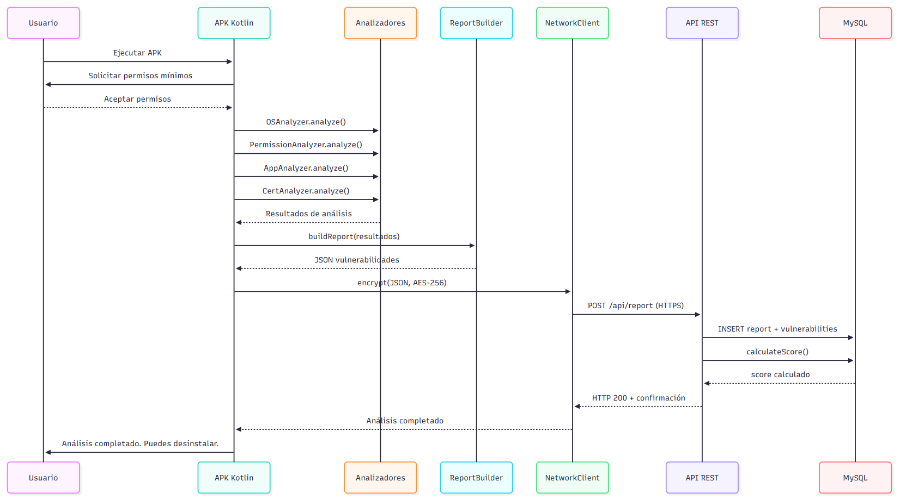{width="6.873090551181102in"
height="3.8336800087489062in"}

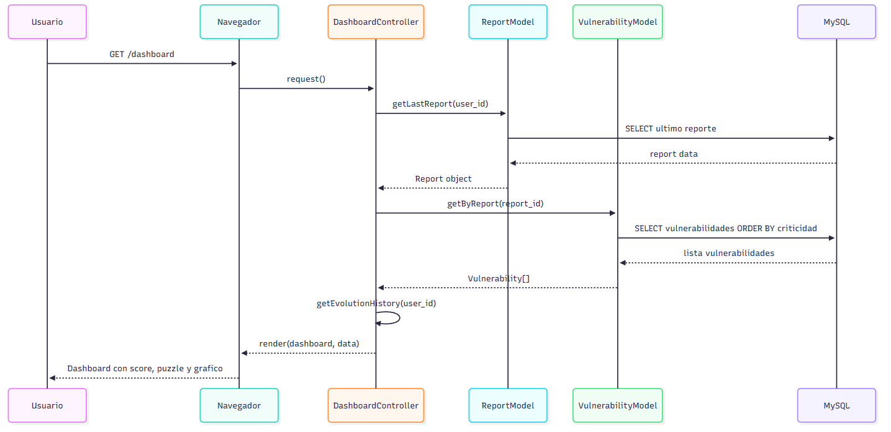{width="6.927577646544182in"
height="3.3721544181977254in"}

## Diagrama de Colaboración

> El diagrama de colaboración describe cómo los objetos del sistema
> interactúan para cumplir el flujo de análisis y generación de score.
> Los objetos participantes son: APKSession, OSAnalyzer,
> PermissionAnalyzer, AppAnalyzer, CertAnalyzer, ReportBuilder,
> NetworkClient, API REST, Report, Vulnerability y User.

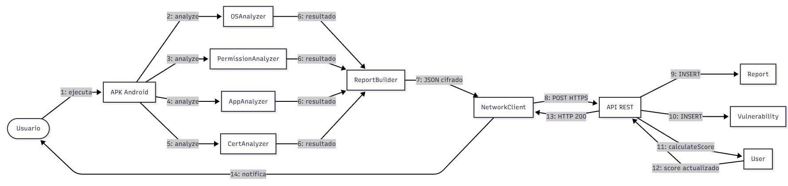{width="6.947916666666667in"
height="1.812846675415573in"}

## Diagrama de Objetos

> El diagrama de objetos muestra una instancia representativa del
> sistema en el momento en que un usuario ha completado su primer
> análisis de seguridad, con vulnerabilidades detectadas y score
> calculado.

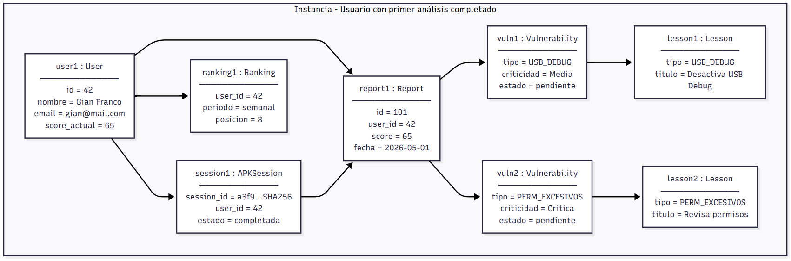{width="6.885416666666667in"
height="2.438862642169729in"}

## Diagrama de Clases

> El diagrama de clases define la estructura estática del modelo de
> dominio de AnzenCore. Las clases principales del sistema son:

  **Clase**       **Atributos Principales**                                                    **Métodos Principales**
  --------------- ---------------------------------------------------------------------------- -----------------------------------------------
  User            id, nombre, email, password_hash, created_at, score_actual                   register(), login(), getHistory(), getScore()
  Report          id, user_id, session_id, score, fecha_analisis, dispositivo_info             create(), getByUser(), calculateScore()
  Vulnerability   id, report_id, tipo, criticidad, descripcion, estado, lesson_id              list(), markFixed(), getByCriticality()
  Lesson          id, vulnerability_tipo, titulo, contenido, pasos_correccion                  getByType(), markCompleted()
  Ranking         id, user_id, periodo, score_promedio, posicion, vulnerabilidades_repetidas   calculate(), getTopN(), getUserPosition()
  APKSession      session_id, user_id, fecha_generacion, expiracion, estado                    generate(), validate(), expire()

# 

# 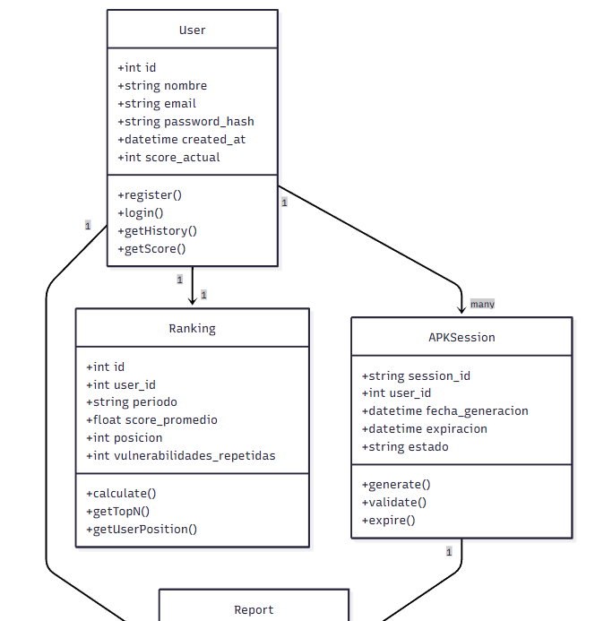{width="4.989837051618547in" height="5.207216754155731in"}

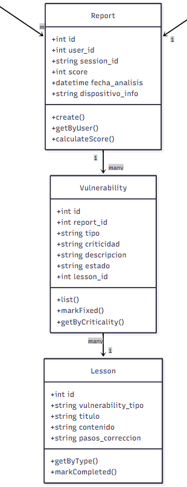{width="2.7163626421697287in"
height="6.010069991251093in"}

## Diagrama de Base de Datos

> El sistema utiliza MySQL como motor de base de datos relacional. Las
> tablas principales son: users, apk_sessions, reports, vulnerabilities,
> lessons, lesson_progress y ranking. Las relaciones clave son: un
> usuario tiene múltiples reportes; un reporte tiene múltiples
> vulnerabilidades; cada vulnerabilidad referencia una lección
> educativa.

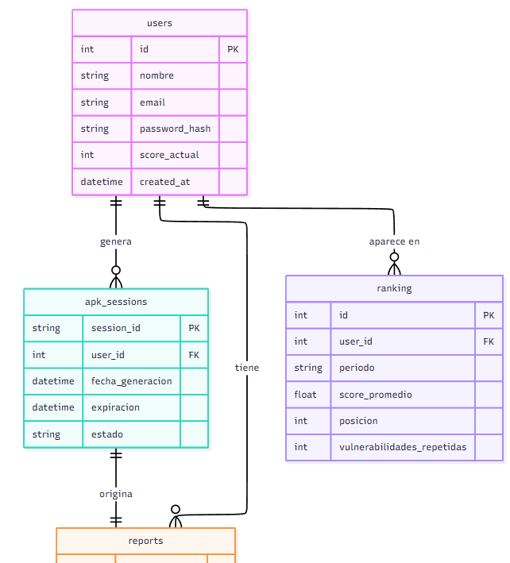{width="4.721057524059493in"
height="5.2265441819772525in"}

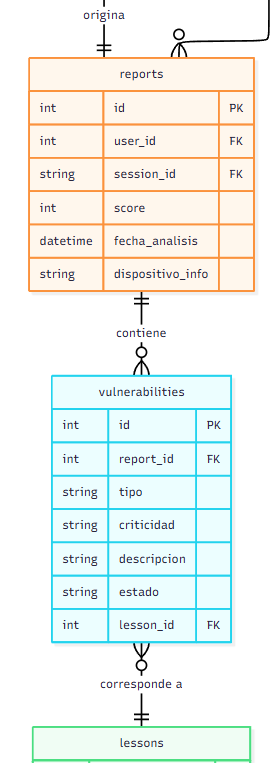{width="2.3541666666666665in"
height="5.572569991251093in"}

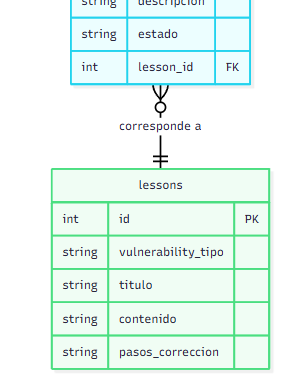{width="2.5244838145231845in"
height="3.225728346456693in"}

# Vista de Implementación

> La vista de implementación detalla la estructura general del modelo de
> implementación de AnzenCore y el mapeo de los subsistemas, paquetes y
> clases de la Vista Lógica a los componentes de implementación reales.

## Diagrama de Arquitectura Software(paquetes)

> AnzenCore implementa una arquitectura de tres capas en el backend web
> (Presentación, Lógica de Negocio, Acceso a Datos) siguiendo el patrón
> MVC en PHP. La APK Android implementa una arquitectura de capas local
> con análisis, construcción de reporte y comunicación de red.

- Capa de Presentación: Vistas PHP (HTML/CSS/JS), Dashboard responsivo.

- Capa de Controladores: AuthController, DashboardController,
  ReportController, RankingController, LessonController.

- Capa de Modelos: UserModel, ReportModel, VulnerabilityModel,
  LessonModel, RankingModel.

- Capa de API: Endpoints REST en PHP para recepción de reportes.

- Capa APK: OSAnalyzer, PermissionAnalyzer, ReportBuilder, NetworkClient
  (Kotlin).

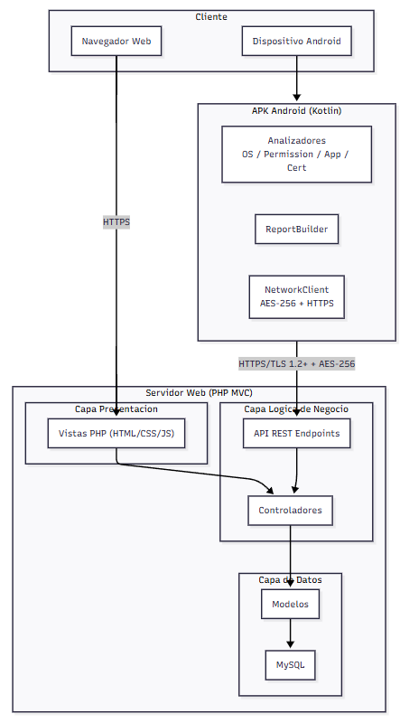{width="3.7744838145231845in"
height="6.324505686789151in"}

## Diagrama de Arquitectura del Sistema(Diagrama de Componentes)

> El diagrama de componentes muestra los módulos ejecutables principales
> del sistema y sus interfaces de comunicación.

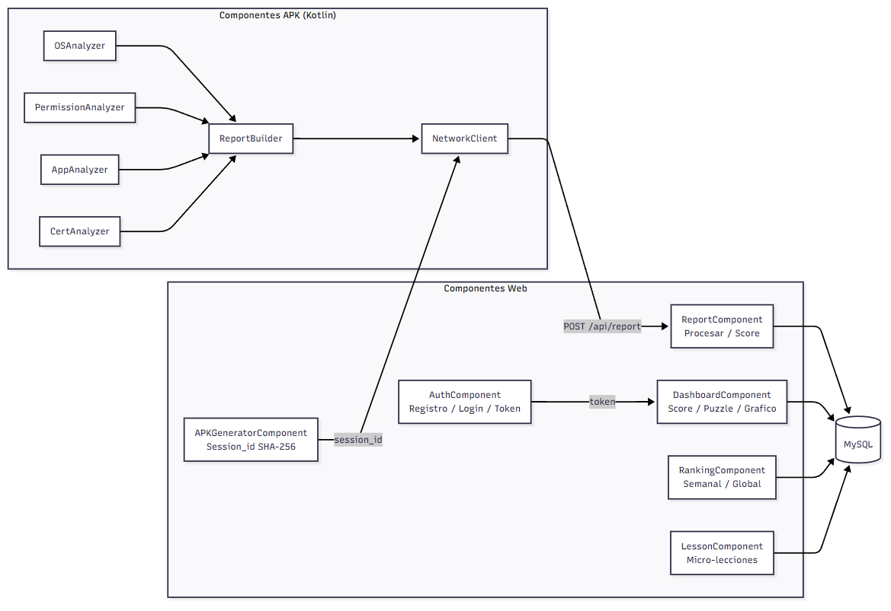{width="6.926042213473316in"
height="4.754146981627296in"}

# Vista de Procesos

> La vista de procesos describe la descomposición del sistema AnzenCore
> en procesos concurrentes e independientes. Identifica qué procesos o
> grupos de procesos se comunican o interactúan entre sí y los modos en
> que se comunican.
>
> AnzenCore involucra los siguientes procesos pesados: Proceso Web PHP
> (servidor HTTP), Proceso de Generación de APK, Proceso de Análisis en
> APK Android, Proceso de API REST (recepción de reportes), Proceso de
> Cálculo de Score y Proceso de Recálculo de Ranking.

## Diagrama de Procesos del Sistema (diagrama de actividad)

> El diagrama de actividad principal muestra el flujo completo desde que
> un usuario registra su cuenta hasta que visualiza su score de
> seguridad y completa una micro-lección para corregir una
> vulnerabilidad detectada.
>
> 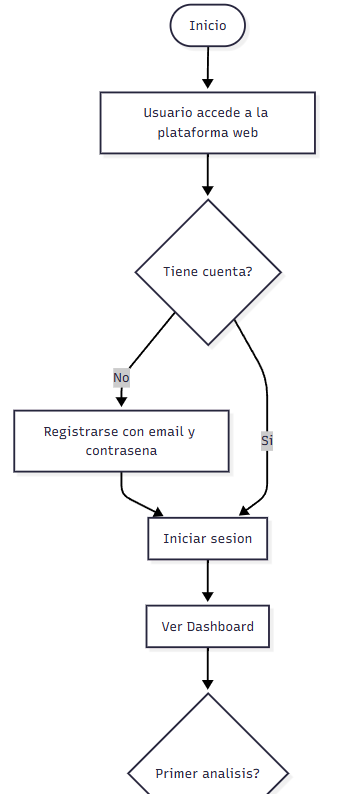{width="2.6007436570428695in"
> height="6.124653324584427in"}
>
> 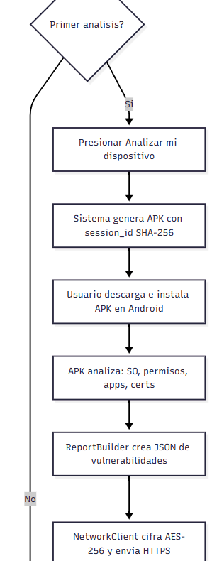{width="2.5208333333333335in"
> height="5.822569991251093in"}
>
> 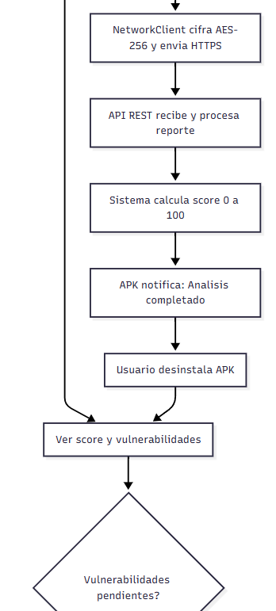{width="2.519815179352581in"
> height="5.583680008748907in"}
>
> 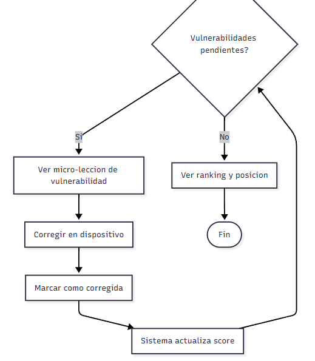{width="4.213884514435695in"
> height="4.83298665791776in"}

# Vista de Despliegue

> La vista de despliegue muestra la distribución física del sistema
> AnzenCore sobre los nodos de infraestructura donde se ejecutará y se
> hará el despliegue del mismo, incluyendo la comunicación entre los
> distintos nodos.

## Diagrama de Despliegue

> El sistema AnzenCore se despliega en los siguientes nodos
> físicos/lógicos:

- Servidor Web (Hosting compartido): Plataforma PHP MVC + API REST, base
  de datos MySQL.

- Dispositivo Android del Usuario: APK Kotlin instalada temporalmente
  para el análisis.

- Navegador Web del Usuario: Dashboard responsivo accedido vía
  HTTP/HTTPS.

- Red de Comunicación: HTTPS/TLS 1.2+ para todas las comunicaciones
  entre nodos.

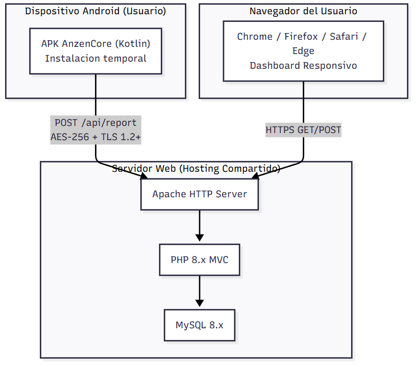{width="5.953798118985127in"
height="5.26076334208224in"}

# ATRIBUTOS DE CALIDAD DEL SOFTWARE

> Los Atributos de Calidad (QAs) son propiedades medibles y evaluables
> del sistema AnzenCore. Se describen a continuación los escenarios de
> calidad más relevantes para la arquitectura del sistema.

## Escenario de Funcionalidad

  **Atributo**              **Descripción**
  ------------------------- ----------------------------------------------------------------------------------------------------------------------------------------------------------------
  Estímulo                  Un usuario descarga la APK, ejecuta el análisis y espera ver su score de seguridad en el dashboard.
  Respuesta esperada        El sistema genera la APK con session_id único, recibe el reporte cifrado, calcula el score y lo muestra en el dashboard con las vulnerabilidades clasificadas.
  Medida                    El 100% de los casos de uso definidos (RF-01 a RF-12) deben estar implementados y verificados con pruebas funcionales.
  Decisión arquitectónica   Arquitectura MVC estricta en PHP + API REST con endpoints documentados garantizan la cobertura funcional completa.

## Escenario de Usabilidad

  **Atributo**              **Descripción**
  ------------------------- ----------------------------------------------------------------------------------------------------------------------------------------------------------------------
  Estímulo                  Un usuario sin conocimientos técnicos accede al dashboard por primera vez desde un smartphone de 360px de ancho.
  Respuesta esperada        El dashboard se muestra correctamente de forma responsiva, el puzzle de vulnerabilidades es intuitivo y las micro-lecciones son comprensibles sin formación técnica.
  Medida                    Tasa de completado de micro-lecciones \> 60%. Dashboard usable en pantallas desde 320px (RNF-05).
  Decisión arquitectónica   Separación de capas MVC con vistas PHP responsivas. Diseño gamificado con puzzle visual que reduce la curva de aprendizaje.

## Escenario de Confiabilidad

  **Atributo**              **Descripción**
  ------------------------- --------------------------------------------------------------------------------------------------------------------------------------------------------
  Estímulo                  La APK pierde conectividad durante el envío del reporte cifrado.
  Respuesta esperada        La APK almacena el reporte cifrado localmente y reintenta el envío cuando recupere conexión. La plataforma web permanece disponible el 99% del tiempo.
  Medida                    Disponibilidad \>= 99% (RNF-04). Cero pérdidas de reportes por falla de red.
  Decisión arquitectónica   Mecanismo de reintento en NetworkClient (Kotlin). Reporte cifrado localmente con AES-256 mientras se restablece conexión.

## 

## Escenario de Rendimiento

  **Atributo**              **Descripción**
  ------------------------- --------------------------------------------------------------------------------------------------------------------------------------------------------
  Estímulo                  1,000 usuarios realizan análisis simultáneamente y envían reportes al servidor.
  Respuesta esperada        El servidor procesa todos los reportes y calcula los scores sin degradación perceptible del servicio.
  Medida                    Análisis \< 60 segundos en dispositivo (RNF-03). Soporte hasta 10,000 usuarios concurrentes (RNF-08). Tiempo de respuesta del dashboard \< 3 segundos.
  Decisión arquitectónica   API REST stateless permite escalabilidad horizontal. Análisis ejecutado 100% en el dispositivo Android, reduciendo carga del servidor.

## Escenario de Mantenibilidad

  **Atributo**              **Descripción**
  ------------------------- ------------------------------------------------------------------------------------------------------------------------------------------------------------------------------
  Estímulo                  Se requiere agregar un nuevo tipo de vulnerabilidad al sistema de análisis.
  Respuesta esperada        Un desarrollador puede añadir el nuevo analizador en la APK y la micro-lección correspondiente en la plataforma web sin afectar los módulos existentes.
  Medida                    Cambio implementado y desplegado en menos de 8 horas de desarrollo. Sin regresiones en funcionalidades existentes.
  Decisión arquitectónica   Patrón MVC estricto (RNF-07). Separación de responsabilidades en la APK (cada analizador es independiente). Estructura modular facilita adición de nuevos tipos de análisis.

## Escenario de Seguridad

  **Atributo**              **Descripción**
  ------------------------- ------------------------------------------------------------------------------------------------------------------------------------------------
  Estímulo                  Un atacante intercepta la comunicación entre la APK y la API REST para leer los datos del análisis del usuario.
  Respuesta esperada        El atacante solo accede a datos cifrados con AES-256, inutilizables sin la clave. La sesión del usuario permanece protegida por token SHA-256.
  Medida                    Cero accesos no autorizados a datos de usuarios. Cumplimiento de RNF-01 (TLS 1.2+) y RNF-02 (privacidad).
  Decisión arquitectónica   Doble capa de cifrado: TLS 1.2+ en transporte + AES-256 en el payload. APK ephémera con session_id SHA-256 único por sesión.

# CONCLUSIONES

- AnzenCore implementa una arquitectura MVC en PHP que garantiza la
  separación de responsabilidades entre controladores, modelos y vistas,
  facilitando el mantenimiento y las pruebas del sistema.

- El diseño de la APK Kotlin como componente efímero (privacy by design)
  es una decisión arquitectónica que diferencia a AnzenCore de
  soluciones tradicionales, eliminando el riesgo de acceso continuo a
  datos del dispositivo.

- La arquitectura API REST stateless permite la escalabilidad horizontal
  del sistema para soportar hasta 10,000 usuarios concurrentes,
  cumpliendo el atributo de calidad de escalabilidad (RNF-08).

- El doble cifrado (TLS 1.2+ en transporte + AES-256 en payload)
  garantiza la confidencialidad de los reportes de análisis, cumpliendo
  los requerimientos de seguridad y privacidad (RNF-01, RNF-02).

- El modelo de vistas 4+1 utilizado permite comunicar la arquitectura a
  todos los stakeholders del proyecto: usuarios, desarrolladores
  Android, desarrolladores web y gestores académicos.

# RECOMENDACIONES

- Implementar pruebas unitarias para los módulos de cálculo de score y
  procesamiento de reportes desde el inicio del desarrollo (TDD),
  alineado con el enfoque del curso de Calidad y Pruebas de Software.

- Realizar pruebas de penetración (pentesting) sobre el endpoint
  /api/report para verificar la resistencia a ataques de inyección y
  replay antes del despliegue.

- Documentar los casos de prueba según el estándar IEEE 829, alineados
  con los 12 requerimientos funcionales definidos en el SRS.

- Considerar la implementación de un sistema de caché (Redis) para el
  cálculo de rankings en iteraciones futuras, mejorando el rendimiento
  bajo alta carga.

- Evaluar la migración a una arquitectura de microservicios en
  iteraciones futuras para mayor flexibilidad en el despliegue de los
  módulos de análisis y educativo.
